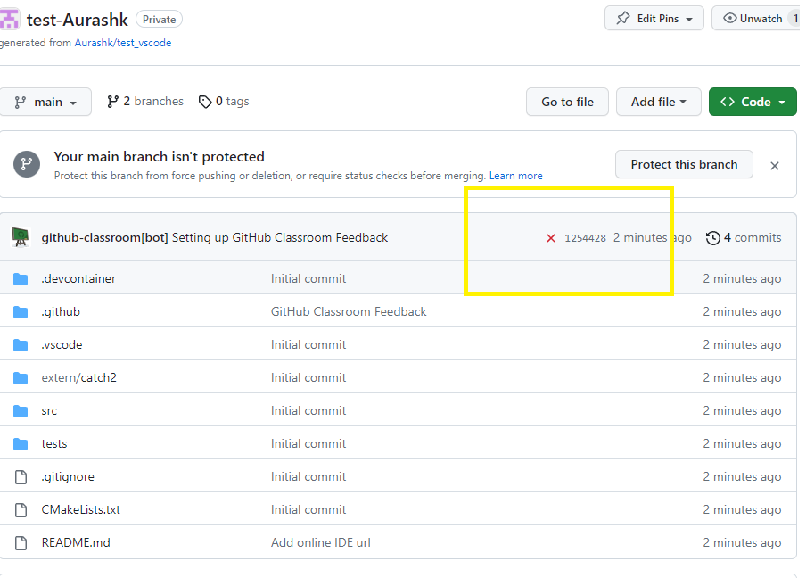

## IB9JHO Environment setup

Follow these instructions to set up your programming environment for IB9JHO and check it works correctly.

- Set up a local environment on your own device (recommended) - see [local environment setup](local-setup.md), which provides a setup script for Windows, macOS and Linux

You are recommended to use your own device for programming because it is much faster, not limited on computing resources, and available offline. You can use a Codespace as a backup/temporary option. 

- **Only as a temporary measure**: Open a codespace in the cloud - see [cloud back up environment](cloud-backup.md)

Always select the **Clang Debug (IB9JHO)** configure preset when prompted while you are working on IB9JHO. This ensures we are all using the same/similar build tools for C++.

# Check your environment works

Test that your environment is working by compiling and running the C++ code in this repository found in src/main.cpp.
If you are not working in a codespace you should first download the repository from github by entering the following command in the terminal on your device.

\* Note that you can copy the correct link from the github page by clicking the green code button, selecting clone, and coping the https link.

```
git clone *https://github.com/IB9JHO-2026-2027/IB9JHO-environment-setup.git folder\to\clone\to
```

You can also download the repository in a zip archive, but you should generally use git clone when you are working with repositories.

Open the folder with Visual Studio Code and follow the instructions below.

1. **Open the cmake tab** This will show you the various executable programs you can build from the source files in your project.
2. **Check that the Clang Debug (IB9JHO) configure preset is selected** The preset is defined in `CMakePresets.json` and selects Clang and Ninja, so we all use the same build tools in the course and avoid any confusion/compatibility issues. If VS Code has not asked you to choose one, click the configure preset in the CMake tab and pick **Clang Debug (IB9JHO)**.
3. **Check that my_program is selected** as the launch target.
4. **Click the play button** to compile and run the launch target you selected (my_program).
5. **Click the terminal tab** This is where standard output will be displayed.
6. **Check the output** You should see the text match the text in src/main.cpp.

<br><br>

# Testing

Assignments are marked automatically using tests which check the output of your code. The tests for this repository are initially failing because the output of our program is not what is expected. The correct output can be found in tests/IO/correct_output.txt.

1. **Open the test tab** This will show you all the tests available for the project.
2. **Click the play button** to run a test
3. **Check the output** The output of the test will be displayed in the output tab. Notice that it reports which line of your program's output differs from tests/IO/correct_output.txt, showing the expected and actual text.
4. **Correct the code** Correct the code and rerun the test to see that it passes.

<br><br>

# Pushing your changes to github

You should push (update) your repository on github regularly to make sure you don't lose any work. Especially if you are programming in a codespace. But keep in mind that it is not easy to reverse your changes once you have pushed them. You can also ask for feedback this way as the module tutor will have access to all the repositories.

## Before your first commit: tell Git who you are

Git records a name and email address with every commit, and refuses to commit until both are set. You only need to do this once per computer. Open a terminal (in VS Code: *Terminal > New Terminal*) and run, using your own name and the email address of your GitHub account:

```
git config --global user.name "Your Name"
git config --global user.email "you@example.com"
```

If you have chosen to keep your email address private on GitHub, use the `@users.noreply.github.com` address shown under *GitHub > Settings > Emails* instead; otherwise GitHub may reject your push. You do not need to do this in a codespace, where it is set for you.

## Signing in to GitHub

Your course and assignment repositories are private, so Git needs to sign in to GitHub to identify you before you can clone or push them. You must use the GitHub account that has access to the repository: for an assignment, the account you accepted it with; for other course repositories, the account that accepted the invitation to the course organisation.

- **In VS Code (recommended):** the first time you clone, pull or push, VS Code asks you to sign in with GitHub. Click **Allow** and complete the sign-in in your browser. You can also sign in beforehand from the *Accounts* icon at the bottom of the left-hand bar.
- **In a terminal on Windows:** Git for Windows opens a browser window to sign in the first time it needs to.
- **In a terminal on macOS or Linux:** install the [GitHub CLI](https://cli.github.com) (`brew install gh` on macOS) and run `gh auth login`, then `gh auth setup-git`. GitHub no longer accepts your account password on the command line.
- **In a codespace:** you are already signed in.

If cloning fails with *Repository not found*, or pushing fails with *Permission denied* or *403*, you are signed in with an account that does not have access (or you have not yet accepted the invitation). Check which account you are using; on Windows, a stale saved login can be removed under *Control Panel > Credential Manager > Windows Credentials* (the `git:https://github.com` entry), and on macOS under *Keychain Access* (search for `github.com`).

## Committing and pushing

1. **Open the source control tab** This will show you all the changes you have made to the repository.
2. **Initialise the repository** To start tracking changes in the repository.
3. **Add a commit message** Write a summary of the changes you made.
4. **Open the commit tab**
5. **Commit and push**
6. **Check github** You should see the changes you made in the repository.

<br><br>
<br><br>

# Submitting Assignments

Assignments are marked automatically by running the same tests you can run in VS Code. Before you submit, make sure every test passes on your own computer: run them from the Testing tab, or from a terminal:

```
cmake --preset clang
cmake --build --preset clang
ctest --preset clang
```

If a test fails, its output names the first line that differs and shows the expected and actual text in quotes, so that missing or extra spaces are easy to spot. Everything your program printed is saved in `build/tests/program_output.txt`.

Once you have pushed your final submission with all the tests passing, the red cross next to your latest commit on GitHub changes to a green tick. Then you can be confident your assignment is complete and your answers are correct.

**Tests are *not* passing yet**
<br><br>

**Tests are passing**
<br><br>
