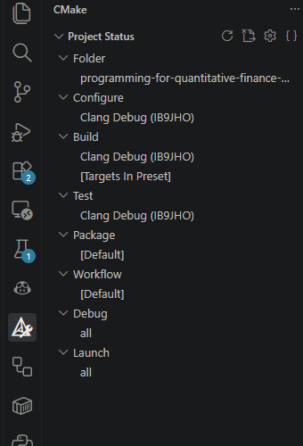
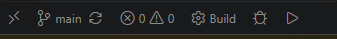

## IB9JHO Environment setup

Follow these instructions to set up your programming environment for IB9JHO and check it works correctly.

- Set up a local environment on your own device - see [local environment setup](local-setup.md), which provides a setup script for Windows, macOS and Linux

You are recommended to use your own device for programming because it is much faster, not limited on computing resources, and available offline. You can use a Codespace as a backup/temporary option. 

- **Only as a temporary measure when flexibility is needed**: Open a Codespace in the cloud - see [cloud back up environment](cloud-backup.md)

Always select the **Clang Debug (IB9JHO)** configure preset when prompted while you are working on IB9JHO. This ensures we are all using the same/similar build tools for C++.

- **Optional** Sign up for GitHub Education. Apply for the free student benefits at [github.com/education/students](https://github.com/education/students) using your university email address. The benefits include free GitHub Pro which gives you more cloud usage for Codespace's above.

# Check your environment works

Test that your environment is working by compiling and running the C++ code in this repository found in src/main.cpp.
If you are not working in a codespace you should first download the repository from github by entering the following command in the terminal on your device.

\* Note that you can copy the correct link from the github page by clicking the green code button, selecting clone, and coping the https link.

```
git clone *https://github.com/IB9JHO-2026-2027/IB9JHO-environment-setup.git folder\to\clone\to
```

You can also download the repository in a zip archive, but you should generally use git clone when you are working with repositories.

Open the folder with Visual Studio Code and follow the instructions below.

1. **Open the cmake tab** This will show you the various executable programs you can build from the source files in your project.
2. **Check that the Clang Debug (IB9JHO) configure preset is selected** The preset is defined in `CMakePresets.json` and selects Clang and Ninja, so we all use the same build tools in the course and avoid any confusion/compatibility issues. If VS Code has not asked you to choose one, click the configure preset in the CMake tab and pick **Clang Debug (IB9JHO)**.
3. **Check that my_program is selected** as the launch target.
4. **Click the play button** to compile and run the launch target you selected (my_program).
5. **Click the terminal tab** This is where standard output will be displayed.
6. **Check the output** You should see the text match the text in src/main.cpp.

<br><br>

# CMake

**The CMake tab** shows what is set up for your project under **Project Status**:

- **Configure**, **Build** and **Test** show the preset in use (Clang Debug (IB9JHO)).
- **Build** also shows which targets will be compiled. `[Targets In Preset]` means every program in the project.
- **Debug** and **Launch** show which program runs when you click the debug or play button.

Hover over a row and click the pencil icon to change it.

<br><br>

**The status bar** at the bottom left of the window is used for rebuilding and running:

- **Build** compiles the current sources. Click it after every change to your code.
- The **bug** icon builds the program and starts it in the debugger.
- The **play** icon builds the program and runs it.

<br><br>

# Testing

Assignments are marked automatically using tests which check the output of your code. The tests for this repository are initially failing because the output of our program is not what is expected. The correct output can be found in tests/IO/correct_output.txt.

1. **Open the test tab** This will show you all the tests available for the project.
2. **Click the play button** to run a test
3. **Check the output** The output of the test will be displayed in the output tab. Notice that it reports which line of your program's output differs from tests/IO/correct_output.txt, showing the expected and actual text.
4. **Correct the code** Correct the code, click **Build** in the status bar, then rerun the test to see that it passes. Note that the test requires a rebuild because it compares the output of running your built program against the expected output.

<br><br>
